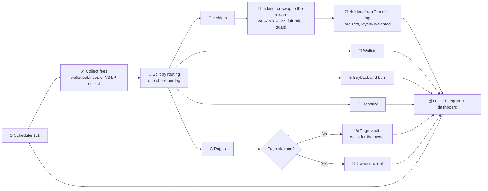

<div align="center">


# ROUTEPAY

### Route your fees anywhere.

**Launchpads on Robinhood Chain pay creators in real stocks. ROUTEPAY decides where those fees go.**
A share to holders, paid in kind. A share to wallets. Buybacks. A stock treasury with a published book value. And a share to any page on the internet: a YouTube channel, a GitHub account, a domain, an X, Instagram, TikTok or Twitch account, a Facebook page. Draw the routing on one screen, each leg with its own share and payout asset. Telegram is the remote; your community watches it happen on a live public dashboard.

[](https://opensource.org/licenses/MIT)
[](https://robinhoodchain.blockscout.com)
[](https://nextjs.org)
[](https://nodejs.org)

</div>

---

## What it does

Robinhood Chain is the first chain where 195 real stocks and ETFs trade as plain ERC-20s (the official Robinhood Stock Tokens), and its launchpads pay creators their fees in those stocks. ROUTEPAY routes a coin's creator fees, every cycle:

1. **💰 Sweeps** the dev wallet: every stock token balance (Multicall3, all 195) and ETH above a gas reserve, plus Uniswap V3 LP fees.
2. **🔀 Applies the routing**: a share to holders, shares to wallets (you, a partner, a DAO), a buyback and burn, a stock treasury, and shares to pages on the internet.
3. **🎁 Pays each leg**: stock fees go out as they are, in kind. Holders are paid pro-rata, weighted by loyalty. ETH fees are converted to the stock you chose (best route across Uniswap V4, V3 and V2, fair-price guarded). A page's share goes to its vault, or straight to the owner's wallet once the page is claimed.
4. **♻️ Repeats** on your schedule: every 1 to 60 minutes, or once a day at the closing bell.

The owner of a page does not need to know about ROUTEPAY beforehand. The funds wait in the vault until they claim.

---

## ✨ Highlights

- 🌐 **Route to any page**: a YouTube channel, a GitHub account, a domain, an X, Instagram, TikTok or Twitch account, a Facebook page. Each page has an on-chain vault and a public profile, and its owner claims by signing in with the platform.
- 🧭 **One canvas**: holders, wallets, buyback and burn, treasury and pages, each leg with its own share and payout asset.
- 🤖 **Telegram remote**: link a token and start a policy in under two minutes; status, receipts and changes from the bot. Pages are added on the web canvas.
- 📈 **195 Robinhood Stock Tokens** from Robinhood's own catalog, with a curated liquid pool that fills at fair value today.
- 🎛️ **Reward modes**: Fixed (any stock, ETH, or **any token by contract address**, even another memecoin) · 🎰 Stock Roulette · 🚀 Top Gainer (the day's best stock) · 📊 Portfolio (rotate a basket: Magnificent 7, AI & Semis, Degen Street, Safe Haven) · 🗳️ Community Vote.
- 🔔 **Wall Street schedules**: closing bell (4 pm ET), opening bell, or any interval restricted to market hours.
- 🛡️ **Fair-price guard**: a stock swap only executes if the pool delivers at least 90% of the Yahoo Finance price. Otherwise holders get ETH that cycle and the dashboard says why.
- 🔗 **No third-party holder API**: balances are rebuilt from Transfer logs on chain; pools, routers, the token, the dev wallet and every contract are excluded.
- 💸 **Batched payouts**: one transfer per holder in parallel waves, or one transaction per 150 holders with the optional `RoutepayDisperse` contract.
- 🔥 **Buyback and burn** as an alternative destination.
- 📊 **Live public dashboards** per token, a directory of pages receiving fees, a live ticker tape, a stock universe page, and a public read-only API.
- 🔐 **AES-256-GCM** encrypted dev-wallet and vault keys; decrypted in memory only, at execution time.

---

## 🔄 How the loop works



---

## 🌐 Pages and claims

A creator can route a share of the fees to any page on the internet: a YouTube channel, a GitHub account, a domain, an X, Instagram, TikTok or Twitch account, a Facebook page. Pages are added as legs on the web canvas (`/app`).

- **A vault per page.** Each page gets its own on-chain vault: a wallet ROUTEPAY creates for that page, with its key encrypted at rest like a dev wallet. Every cycle the page's share is sent to the vault.
- **Public profile.** Anyone can see the vault and its balance on the page's profile at `/p/<platform>/<handle>`, for example `/p/github/your-project`.
- **Directory.** `/pages` lists the pages receiving fees.
- **Claim.** The owner of the page claims at `/claim`: they sign in with the platform (OAuth: Google for YouTube, GitHub, X, Instagram, Facebook, TikTok, Twitch) or, for a domain, publish a DNS TXT record. Then they connect a wallet.
- **Sweep.** The vault is swept to the wallet bound at claim time.
- **Direct payment afterwards.** Once a page is claimed, every cycle pays the owner's wallet directly.

The owner of a page does not need to know about ROUTEPAY beforehand. Funds wait in the vault until they are claimed.

### Switching platforms on

A platform's sign-in is on when both of its values are set in the frontend environment. Until then its pages can still receive fees: they wait in the vault. Register `<NEXT_PUBLIC_SITE_URL>/api/oauth/<name>/callback` as the redirect URI with each platform.

| Platform | `<name>` | Variables (frontend) | What the app must be allowed to read |
|---|---|---|---|
| GitHub | `github` | `OAUTH_GITHUB_CLIENT_ID`, `OAUTH_GITHUB_CLIENT_SECRET` | `read:org` (accounts, and organisations the user owns) |
| YouTube | `youtube` | `OAUTH_GOOGLE_CLIENT_ID`, `OAUTH_GOOGLE_CLIENT_SECRET` | `youtube.readonly` |
| X | `x` | `OAUTH_X_CLIENT_ID`, `OAUTH_X_CLIENT_SECRET` | `users.read`, `tweet.read` |
| Twitch | `twitch` | `OAUTH_TWITCH_CLIENT_ID`, `OAUTH_TWITCH_CLIENT_SECRET` | nothing beyond the public profile |
| Facebook | `facebook` | `OAUTH_FACEBOOK_CLIENT_ID`, `OAUTH_FACEBOOK_CLIENT_SECRET` | `pages_show_list` |
| Instagram | `instagram` | `OAUTH_INSTAGRAM_CLIENT_ID`, `OAUTH_INSTAGRAM_CLIENT_SECRET` | `instagram_business_basic` (professional accounts) |
| TikTok | `tiktok` | `OAUTH_TIKTOK_CLIENT_ID`, `OAUTH_TIKTOK_CLIENT_SECRET` | `user.info.basic`, `user.info.profile` |
| Domain | | none | a TXT record on `_routepay.<domain>` |

The access token is used once, to read which pages the account runs, and is not stored. Meta and TikTok review an app before it can be used by the public.

Backend: `PAGES_GAS_PRIVATE_KEY` is a wallet that lends a vault the gas of its sweep when the vault holds tokens but no ETH (capped by `PAGES_GAS_TOPUP_MAX_ETH`). Page legs are paid in ETH by default so that most vaults pay for themselves.

Two scripts check the whole flow against a scratch database (they write test rows, never point them at production):

```bash
cd backend && node scripts/test-pages.mjs                          # routing engine, sweep queue
cd frontend && node scripts/e2e-pages.mjs http://localhost:3001    # routing to a page, profile, claim
```

---

## 💻 Tech stack

| Layer | Stack |
|---|---|
| **Backend** | Node.js · Express · Telegraf · `viem` · `node-cron` |
| **Frontend** | Next.js 16 · React 19 · Tailwind CSS · Recharts · `viem` (signatures) |
| **Data** | Neon (PostgreSQL) |
| **Chain** | Robinhood Chain (4663) · Uniswap V4 / V3 / V2 · Blockscout |
| **Prices** | Yahoo Finance (fair-price oracle, ticker tape) · DexScreener (token metadata) |

---

## 🗂️ Project structure

```
routepay/
├── backend/
│   └── src/
│       ├── brand.js            # product name, site, handles, project token
│       ├── chain/
│       │   ├── config.js       # chain, addresses, clients
│       │   ├── stocks-data.js  # the 195 Stock Tokens (mirrored in frontend/lib)
│       │   └── stocks.js       # registry helpers, liquid pool, baskets
│       ├── services/
│       │   ├── fees.js         # wallet balance / Uniswap V3 collect
│       │   ├── swap.js         # V4 → V3 → V2 router with the fair-price guard
│       │   ├── oracle.js       # Yahoo Finance quotes
│       │   ├── holders.js      # Transfer-log holder ledger (Postgres)
│       │   ├── airdrop.js      # ERC-20 / ETH payouts, Disperse, burn
│       │   ├── rewards.js      # reward modes
│       │   ├── schedule.js     # intervals, bells, market hours
│       │   └── encryption.js   # AES-256-GCM key handling
│       ├── bot/                # Telegram bot (commands, keyboards, flows)
│       ├── scheduler/          # cron + executor (the loop)
│       ├── db/                 # Neon connection, queries, migrations
│       └── api/                # REST endpoints
├── contracts/
│   └── RoutepayDisperse.sol    # optional batch payout contract
└── frontend/
    ├── app/                    # Next.js routes + API (/api/v1/*, dashboards, /pages, /p, /claim, /stocks, /vote)
    ├── components/             # TickerTape, Hero, StockUniverse, LiveFeed, dashboards…
    └── lib/                    # queries, token metadata, stock registry, wallet hook
```

---

## 🚀 Quick start

> Requires Node 20+, a Neon (or any Postgres) database, and a Robinhood Chain RPC. The public endpoint works; Alchemy or QuickNode give higher limits for the holder indexer.

```bash
# Backend
cd backend
npm install
cp .env.example .env        # DATABASE_URL, RH_RPC_URL, TELEGRAM_BOT_TOKEN, MASTER_ENCRYPTION_KEY
npm run migrate
npm run dev                 # API + Telegram bot + scheduler

# Frontend
cd ../frontend
npm install
cp .env.example .env.local  # DATABASE_URL, NEXT_PUBLIC_BOT_USERNAME
npm run dev                 # http://localhost:3001
```

Generate an encryption key:

```bash
node -e "console.log(require('crypto').randomBytes(32).toString('hex'))"
```

Probe a stock's route before trusting it (read-only, no funds):

```bash
cd backend && node scripts/probe-stock.mjs NVDA 0.01     # one ticker
node scripts/probe-stock.mjs LIQUID 0.01                  # the liquid pool
node scripts/probe-stock.mjs ALL 0.01                     # all 195
```

### Optional: batch payouts

Deploy `contracts/RoutepayDisperse.sol` on Robinhood Chain (any Solidity 0.8.20+ toolchain, no constructor arguments) and set `DISPERSE_ADDRESS` in the backend `.env`. Payouts then go out 150 holders per transaction instead of one transfer each.

---

## 🔌 Public API

| Endpoint | Description |
|---|---|
| `GET /api/v1/tokens` | Every token with an active bot: reward, mode, schedule, payouts, sorted by market cap |
| `GET /api/v1/token/<address>` | Is a token linked? Its reward, schedule and stats |
| `GET /api/v1/stocks` | The 195 Robinhood Stock Tokens, with addresses and liquidity flags |
| `GET /api/v1/stats` | Global stats: ETH paid out, dividend cycles, active bots |
| `GET /api/v1/activity` | Recent linked tokens and dividends |

---

## 🔐 Security

- **AES-256-GCM** encryption for every dev-wallet and page vault private key; decrypted only in memory, only at execution.
- The bot only collects fees, swaps on Uniswap, and transfers to the legs of the routing. Nothing else runs against the wallet.
- Parameterized SQL everywhere; secrets live in `.env` (never committed).
- A dev wallet should be **dedicated and disposable**, funded with a little ETH for gas: never your main wallet.

---

## ⚠️ Disclaimer

ROUTEPAY handles real funds and private keys on Robinhood Chain mainnet. Use at your own risk: start small, use a dedicated dev wallet, keep your `MASTER_ENCRYPTION_KEY` safe, and monitor executions. Not affiliated with Robinhood Markets; Stock Tokens are issued by Robinhood, ROUTEPAY only routes them. ROUTEPAY is not affiliated with YouTube, GitHub, X, Meta, TikTok or Twitch.

---

## 📝 License

MIT

<div align="center">

**Built for token creators on Robinhood Chain.**
Route your fees anywhere.

</div>
